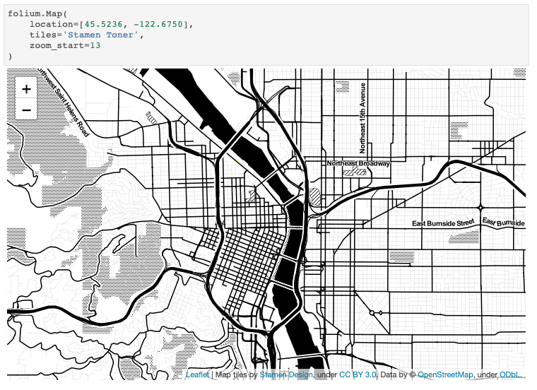

# A Practical Learning Roadmap for Complete Beginners

### Step 0:

_Prerequisite:_

-   Zero programming experience / Complete beginners.

_Learning Material:_

Watch some awesome lecture videos from Harvard University CS50: Introduction to Computer Science (v2015) by David Malan.

1. [CS50: Week 0 Lecture](https://youtu.be/zFenJJtAEzE)
2. [CS50: Week 0 continued Lecture](https://youtu.be/UuFWYOnHwGM)

Just to watch this two lectures only, you should be able to get a grasp of what programming is, and be able to create your own Scratch (A graphical/ visual programming language) program. Of course, you can finish this course online as well if you found it interesting and useful.

### Step 1: Familiarise with Terminologies and Setup Your Development Environment

1.1 Some Terminologies

-   Compiler / Interpreter
-   Source Code / Machine Code
-   Python Module / Package / Library
-   Text Editors / IDE (Integrated Development Environment)
    -   [Atom](https://atom.io) - A good text (and good-looking) editor
    -   [Vim](https://www.vim.org/download.php) - A customisable text editor (require some effort to learn)
    -   [Emacs](https://www.gnu.org/software/emacs/) - A customisable text editor
    -   [Sublime Text](http://www.sublimetext.com) - A good (and good-looking) text editor
    -   [Visual Studio Code](https://code.visualstudio.com) - A general Open Source IDE by Microsoft
    -   [PyCharm](https://www.jetbrains.com/pycharm/) - A Python IDE by IntelliJ
    -   [Spyder](https://www.spyder-ide.org) - A scientific Python IDE

1.2 Environment Set up

_What you need to do / know:_

-   Install python on your machine properly
-   Choose a text editor or an IDE as your main development tool
-   Know how to run python script from an IDE
-   Know how to run python script from a terminal / shell
-   Know how to use basic commands in Command Line Interface (CLI)
    -   Know how to navigate around directories in your file system
    -   Know how to open/ create / move files

_Resources_

-   Deep Learning powered Auto Completion
    -   [TabNine](https://tabnine.com/)
    -   [kite](https://kite.com/)
-   Python Code Formatter
    -   [Black](https://black.readthedocs.io/en/stable/)
-   For macOS user, you may follow to this guide to install Python: [How to Install Vanilla Python on macOS Properly?](docs/python-install-guide.md)
-   If you have the need to use multiple Python versions on your machine, you need to check out [pyenv](https://github.com/pyenv/pyenv).

> If you are a computer science/ computer engineering / robotics student, you should also:
>
> -   Learn how to use command line interface (CLI): [How to use command line for UNIX-based system](https://www.taniarascia.com/how-to-use-the-command-line-for-apple-macos-and-linux/)
> -   Learn how to use Git and Github

### Step 2: Think Like a Computer Scientist

_Learning Material:_

Finish these book along with practices:

-   How to Think Like a Computer Scientist: Learning with Python 3 (Book):
    [[Download PDF]](https://buildmedia.readthedocs.org/media/pdf/howtothink/latest/howtothink.pdf) / [[Read Online]](http://openbookproject.net/thinkcs/python/english3e/)

_Learning Objective:_

-   Python syntax
-   Python basic built-in functions
-   Object Oriented Programming

### Step 3: Deep Dive into Python's Built-in Libraries

-   [Intermediate Python](https://github.com/yasoob/intermediatePython)

#### Mini Languages

-   [Format Specification Mini-Language](https://docs.python.org/3/library/string.html#format-specification-mini-language)
-   [Regular Expression](https://docs.python.org/3/library/re.html)

#### Dealing with operating system

-   [os](https://docs.python.org/3/library/os.html)
-   [sys](https://docs.python.org/3/library/sys.html)
-   [pathlib](https://docs.python.org/3/library/pathlib.html)
-   [shutil](https://docs.python.org/3/library/shutil.html)
-   [argparse](https://docs.python.org/3/library/argparse.html)
-   [logging](https://docs.python.org/3/library/logging.html)

#### Advanced data types:

-   [collections](https://docs.python.org/3/library/collections.html)

### Step 4: Choose an Area to Practice Your Python Skills

#### Web Development

-   [Flask](https://flask.palletsprojects.com/en/1.1.x/) (most basic web library for Python)
-   [FastAPI](https://fastapi.tiangolo.com/) (Highly recommended library)
-   [CS50’s Web Programming with Python and JavaScript](https://cs50.harvard.edu/web/2018/) (Highly recommended course)

#### Data Analysis & Visualization

-   [Matplotlib](https://matplotlib.org/)
    -   [Matplotlib Cheatsheet](https://github.com/rougier/matplotlib-cheatsheet)
    -   [Scientific Visualization Book](https://github.com/rougier/scientific-visualization-book)
-   [Pandas](https://pandas.pydata.org/)
-   [Python for Data Analysis, 2nd Edition](https://learning.oreilly.com/library/view/python-for-data/9781491957653/)
-   [Web Crawler](http://aosabook.org/en/500L/a-web-crawler-with-asyncio-coroutines.html)
-   [Map Visualisation: Folium](https://github.com/python-visualization/folium)
    

#### Computer Vision

-   [pyimagesearch](https://www.pyimagesearch.com/)

#### Machine Learning / Deep Learning

-   [numpy](https://numpy.org/doc/stable/)
-   [scipy](https://docs.scipy.org/doc/scipy/reference/)
-   [Coursera - Machine Learning by Stanford](https://www.coursera.org/learn/machine-learning)

### Step 5: Sharpen your Tools
